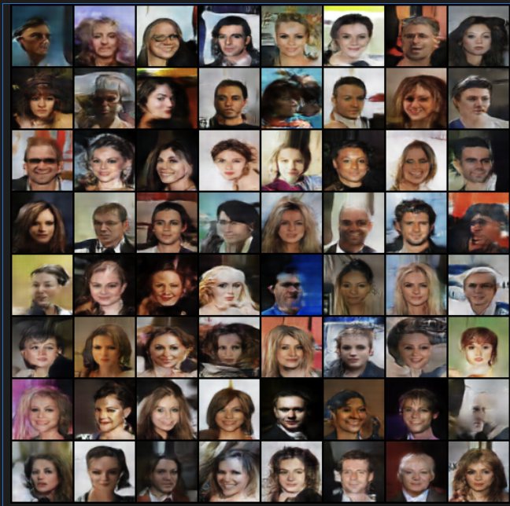
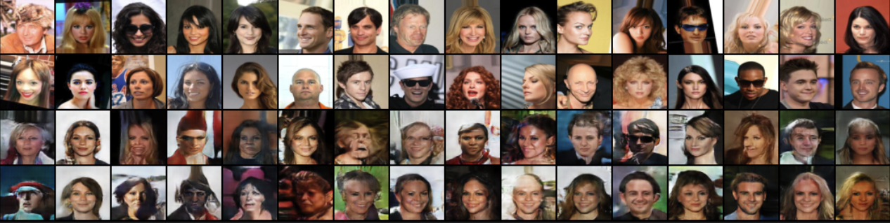

# Face Generation using DCGAN

  
  
  

## Overview
This repository contains a PyTorch implementation of a Deep Convolutional Generative Adversarial Network (DCGAN) to generate realistic human faces using the CelebA dataset.

The code is provided as a Jupyter notebook, allowing you to easily run and experiment with the DCGAN model. Due to computational constraints, the notebook was trained for 15 epochs, but you can modify and run it for more epochs as desired (suggested: 50+).

---

## What is a DCGAN?
In short, a DCGAN consists of two main components: the generator and the discriminator.

* **Generator:** The generator takes a random noise vector as input and generates an image. It learns to transform the input noise into images that resemble the training data. The generator's objective is to create realistic images that can deceive the discriminator.
* **Discriminator:** The discriminator is a binary classifier that learns to distinguish between real images from the training dataset and fake images generated by the generator. Its objective is to correctly classify images as real or fake. The discriminator provides feedback to the generator, helping it improve its generated images.

---

## Dataset: CelebA
The model is trained on the [CelebFaces Attributes (CelebA) Dataset](https://www.kaggle.com/datasets/jessicali9530/celeba-dataset), which contains over 200,000 celebrity images.
* **Preprocessing:** Images are cropped, resized to `64x64` pixels, and normalized to the `[0, 1]` range.

---

## How to Run
To run the face generation code, follow these steps:

1.  Open the provided Jupyter notebook, `CelebA_Face_Generation_DCGAN.ipynb`, in Google Colab or your local environment.
2.  Make sure you have a compatible GPU runtime enabled (e.g., T4 GPU in Colab) to speed up the training process.
3.  Ensure you have your `kaggle.json` configured to download the dataset directly via the Kaggle API.
4.  Execute the notebook cells sequentially to load the required libraries, define the DCGAN architecture, and train the model.
5.  You can adjust the hyperparameters, such as the learning rate (`2e-4`), number of epochs, and batch size (`128`), according to your requirements.
6.  After training, the notebook will generate synthetic human faces. You can visualize the generated faces and experiment with different hyperparameters to observe the changes in the generated images.

---

## Results & Analysis
The adversarial training demonstrated a healthy balance between the two networks:
* **Loss Curves:** The Discriminator's loss gradually stabilized around `0.3`, while the Generator's loss fluctuated normally between `3.0` and `5.0`. There were no signs of mode collapse.
* **Visual Evolution:**
    * *Early Epochs (1-3):* The network outputted blurry, abstract facial structures.
    * *Middle Epochs (7-10):* Key facial features (eyes, hair, skin tone) became coherent.
    * *Final Epochs (15):* The model successfully generated high-fidelity faces with consistent lighting and spatial proportions.
    * ### Generated Faces Comparison

**Samples generated after 15 epochs:**

**Real Faces (Top) vs. Generated Faces (Bottom):**

---

## Future Improvements
The DCGAN implementation in this notebook serves as a strong foundation for face generation. For more advanced results, you can explore additional techniques such as:
* Normalizing the dataset to the `[-1, 1]` range with a `Tanh` output layer in the generator for enhanced mathematical stability.
* Progressive growing or spectral normalization.
* Incorporating more complex architectures like WGAN-GP or StyleGAN for higher resolution outputs.
